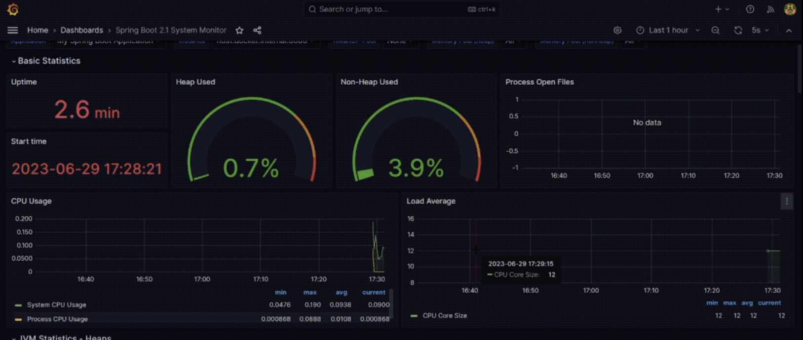

# Things that I have learned here

- Set up Prometheus and Grafana 
- Import a simple dashboard to monitor health status of an Spring boot App

| Item  | Result |
| ------------- | ------------- |
| Sample Dashboard  |  |

## Reference
[Revolutionize monitoring empowering spring-boot apps with prometheus and grafana](https://medium.com/simform-engineering/revolutionize-monitoring-empowering-spring-boot-applications-with-prometheus-and-grafana-e99c5c7248cf)